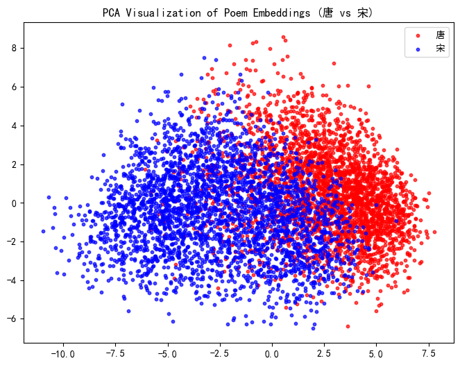
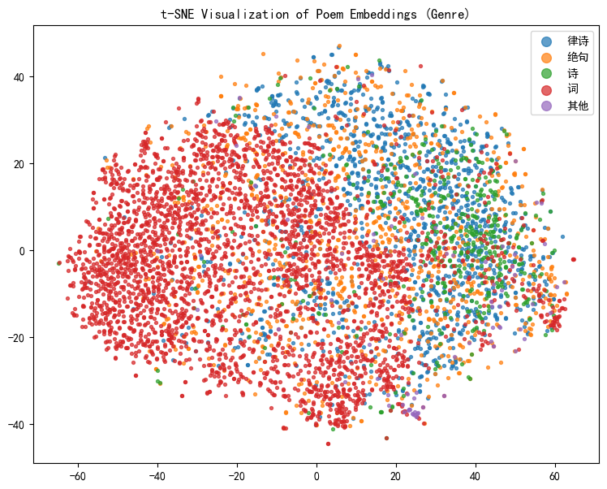
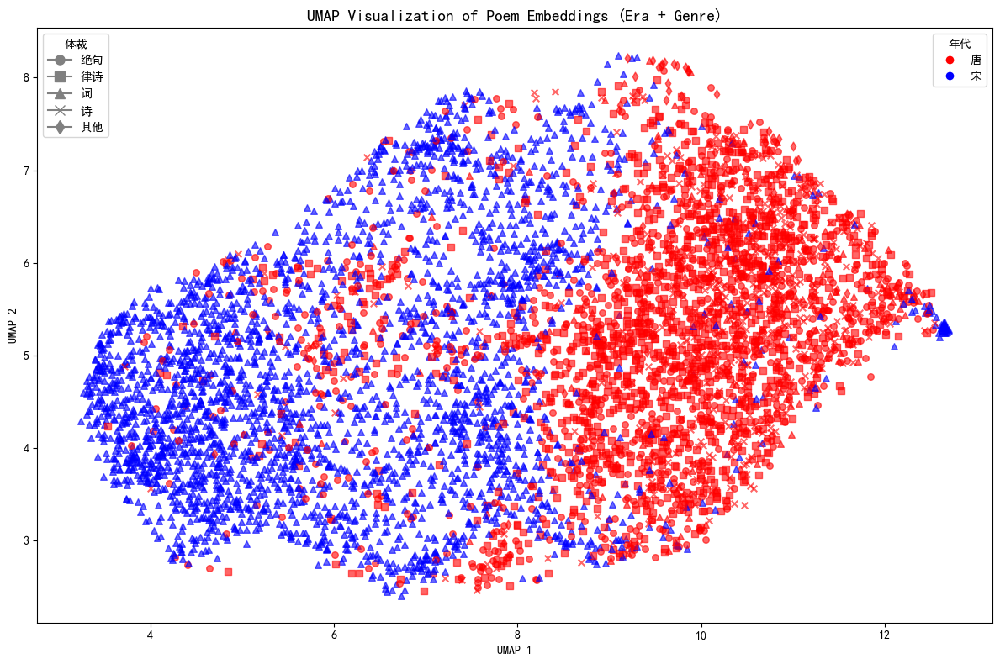

# Probing-Era-and-Genre-Separability-in-Chinese-Classical-Poetry-Embedding-Spaces

This repository contains the full pipeline, code, and experiments for analyzing whether **pretrained embedding models** encode **era** (e.g., *Tang* vs. *Song*) and **genre** (e.g., *jueju*, *lüshi*, *ci*) information in **Chinese classical poetry**.  
Our goal is to determine **how separable these categories are** in the embedding space using simple classifiers and visualization techniques.

This project follows a typical **embedding probing** workflow—without training large models or performing text generation—making it suitable for undergraduate-level NLP/ML coursework.

---

## 📌 1. Project Overview

### Research Questions
We aim to answer:

1. **Does the poem embedding contain enough information to distinguish between dynasties (Tang vs. Song)?**  
2. **Can embeddings also separate poetic genres (jueju, lüshi, ci)?**

These questions are tested using:

- Off-the-shelf embedding models  
- Lightweight classifiers (Logistic Regression / MLP)  
- Standard probing methodology  

No fine-tuning of large language models is required.

---

## 📂 2. Repository Structure

```
/data/                 # Scripts or raw data for preprocessing (not included by default)
    └── 诗歌数据.csv

/embedding/            # Embedding generation code
    └── Embedding Model_BERT_CCPoem_v1.py   # Custom BERT embedding extractor
    └── output.npy                          # Transform .csv to .npy

/classifier/           # Classifier training notebooks/scripts
    └── train_classifier.ipynb              # Training for era/genre classifiers

/visualization/        # Dimensionality reduction and plotting (PCA, t-SNE, UMAP)
    └── train_classifier.ipynb              # Visualize
    └── vis1.png                            # PCA Visualization
    └── vis2.png                            # UMAP Visualization
    └── vis3.png                            # PCA Visualization

Requirement.txt        # Coding environment
README.md              # Project documentation (this file)
```

---

## 🔧 3. Pipeline Overview

This project contains five stages:

### **Stage 1 — Data Collection & Labeling**
- Use publicly available Chinese poetry datasets (e.g., *chinese-poetry*).
- Extract:
  - **Dynasty / era** labels: Tang, Song  
  - **Genre** labels: jueju, lüshi, ci  
- Convert all metadata into a single CSV dataset.

### **Stage 2 — Text Embedding**

Embeddings are generated using a custom **Chinese Classical Poetry BERT Model**.

Key features:

- Tokenization via `BertTokenizer`
- Supports batching & GPU acceleration
- Mean-pooling over valid tokens  
- Generates `output.npy`: An `N × d` embedding matrix

Run the embedding generator:

```bash
python Embedding\ Model_BERT_CCPoem_v1.py
```

### **Stage 3 — Classifier Training**

- Tasks:
  - **Era classification** (binary)
  - **Genre classification** (3-way or more)
- Models:
  - Logistic Regression (baseline)
  - Optional small MLP
- Evaluation:
  - Train/Validation/Test split
  - Avoid overfitting

### **Stage 4 — Quantitative Evaluation**

Metrics include:

- Accuracy  
- Precision, Recall, F1  
- Confusion matrix  
- ROC curve (optional)

### **Stage 5 — Visualization**

Techniques:

- PCA  
- t-SNE  
- UMAP  

Visualizations aim to demonstrate separability of eras and genres.

---

## 📊 4. Expected Results

Typical results for classical poetry embeddings:

- **Era Classification**: >90% accuracy  
- **Genre Classification**: 75–85% accuracy  
- **Visualization**: clear clustering by dynasty or genre

---

## 💻 5. Code Highlights

### Example: BERT Embedding Usage

```python
model, formatter = init()
result = predict_vec_rep(["一行白鹭上青天"], model, formatter)[0]
```

### Cosine Similarity:

```python
cos_sim(vec1, vec2)
```

---

## 📑 6. Deliverables

- `output.npy` embedding vectors  
- Classification results (accuracy tables, confusion matrices)  
- Visualization plots (PCA, t-SNE, UMAP)  
- Final report (optional)

---

## 👥 7. Suggested Team Roles

| Role | Responsibilities |
|------|------------------|
| Data Engineer | Dataset preparation |
| Embedding Engineer | BERT embedding generation |
| ML Engineer | Training classifiers |
| Visualization Lead | Plotting & report writing |

---

## 📌 8. How to Run

### 1. Install Dependencies
```bash
pip install torch transformers numpy scikit-learn matplotlib umap-learn
```

### 2. Prepare Dataset
Place `诗歌数据.csv` with columns:

```
title | author | content | dynasty | genre
```

### 3. Generate Embeddings
```bash
python Embedding\ Model_BERT_CCPoem_v1.py
```

### 4. Train Classifiers
Open:

```
classifier/train_classifier.ipynb
```

### 5. Visualize Results

Below are the visualization results generated from the embedding space:

### **PCA Visualization**



### **t-SNE Visualization**


### **UMAP Visualization**



## 📬 9. Citation

```
Probing Era and Genre Separability in Chinese Classical Poetry Embedding Spaces
GitHub: https://github.com/3451449381/Probing-Era-and-Genre-Separability-in-Chinese-Classical-Poetry-Embedding-Spaces
```

---

## 📝 10. License

For academic and educational use only.
